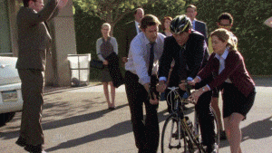

# Mapty ⏱🏃‍♀️🦶

This is a project created by Jonas Schmedtmann for his UDEMY course 'The Complete JavaScript Course 2023: From Zero to Expert!'

# About the application 🚴

Mapty, built using the fundamental trio - JavaScript, HTML, and CSS, provides users with a visual representation of their physical achievements on a map. Ideal for runners and cyclists alike, Mapty blends the lines between fitness tracking and geolocation.

## How does it work?

- **Enable Location**: Begin by allowing the app to access your location. This ensures your workout gets mapped accurately.
- **Choose Your Workout**: Whether it's a sprint around the park or a long bike ride across the city, select the type of workout you've accomplished.
- **Provide Workout Details**: Based on the workout type, a tailored form will appear. Fill in essential metrics like distance (km), time (minutes), and specific parameters - cadence for running and elevation gain for cycling.
- **Spot Your Activity**: Upon submission, a distinct balloon marker pops up on the map, pinpointing your workout's location together with type of workout and the date it was executed.
- **Interactive Experience**: One of Mapty's standout features is its interactive list of workouts. Click on any entry, and the map will smartly zoom into the corresponding workout spot.
- **Persistence**: Mapty employs local storage, ensuring your list of workouts remains available each time you return to the site.

# 💊 Learning goals

- Acquire proficiency in harnessing the geolocation capabilities of the Leaflet JS library.
- Construct an application employing Object-Oriented Programming (OOP) principles.
- Enhance skills in navigating and interpreting technical documentation.
- Refine techniques for effective DOM manipulation.
- Practice the use of local storage for data persistence.   

This project, while modest, played an important role in honing my JavaScript skills. Beyond that, it sparked my interest in different architectural approaches and the importance of thinking about the big picture. There's ample room for refinement and numerous features I envision introducing in the future. When time permits, I'll delve deeper into those enhancements.

  
I hope you enjoyed playing around with the app, and got a bit motivated to go for a ride! 🙌

let's goooooo

